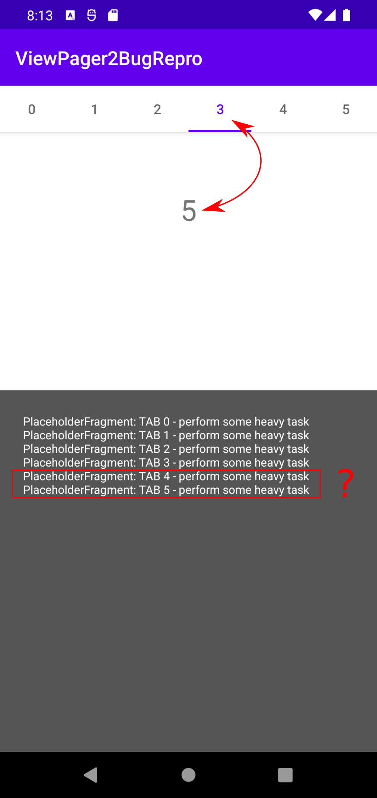

ViewPager2 wrong page selected bug repro
===

1. Clone this repo
2. Build and run this app
3. Click the **No. "3"** tab
4. You will see the following log in the bottom text area
    ```
    PlaceholderFragment: TAB 0 - perform some heavy task
    PlaceholderFragment: TAB 1 - perform some heavy task
    PlaceholderFragment: TAB 2 - perform some heavy task
    PlaceholderFragment: TAB 3 - perform some heavy task
    PlaceholderFragment: TAB 4 - perform some heavy task
    PlaceholderFragment: TAB 5 - perform some heavy task
    ```
5. The pager contents maybe jumped to **No. 5** despite you selected **No. 3**. However, it is related to timing and it only occurs with debug mode on my env...


